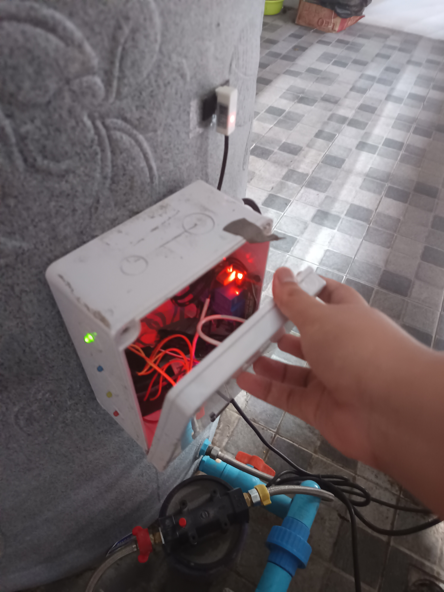
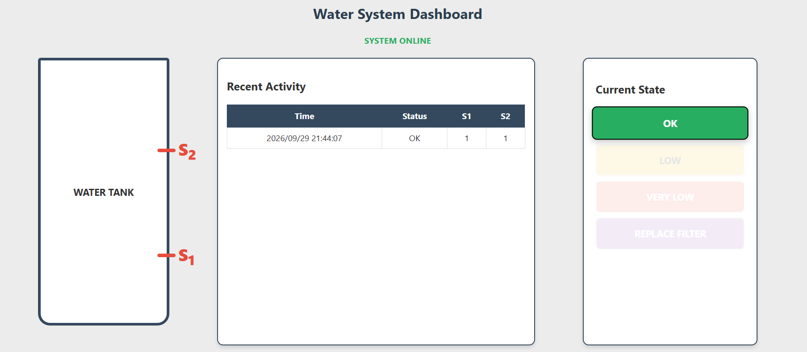

# Water-Tank-Home-Project
**Sorry for my informal English.**
**If you found a typo , please contact.**

### This is a (Kinda Mini) Project that I made in my home to know when the tank is going to run out of water.
- I use ESP32 as Microcontroller and  XKC-Y25-T12V Non-Contact Water Level Sensor to measure water level in tank.
- Including 4 LEDs as Indicator and Notification on LINE via Messaging API with WebServer Log.
- **For Connections,Both Sensor and LED can use any Digital Pin or You can check my !**

### For WebServer We use WebSocket recieving HTTP Request from ESP32 to update Logs.

-**The logs will start saving the moment you open the dashboards and gone after you close. There is no  local Database yet😭😭**

